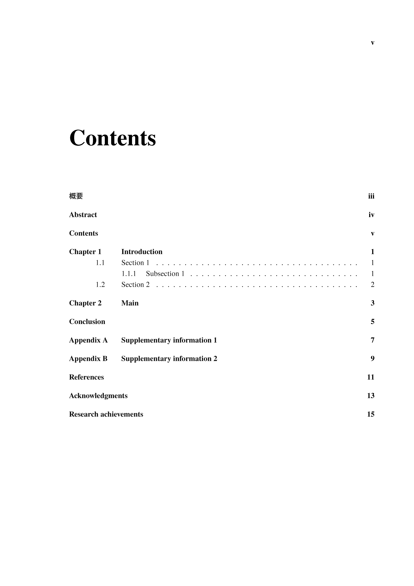
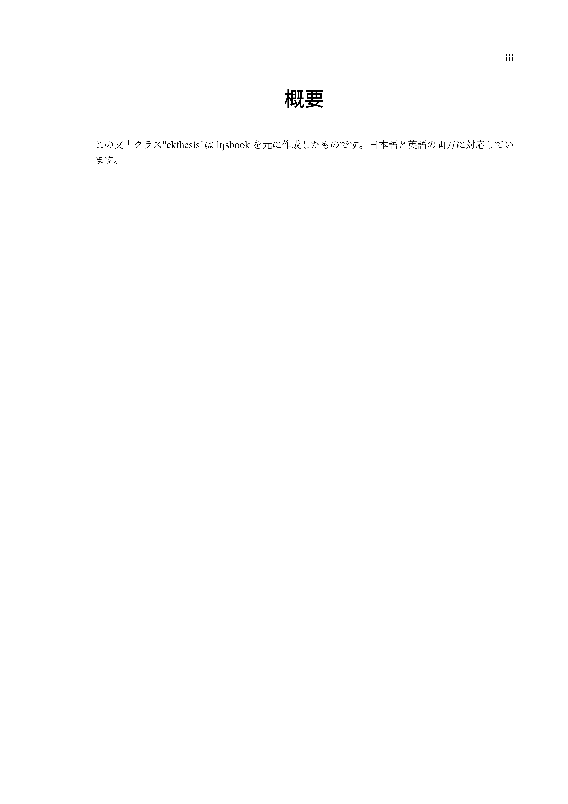
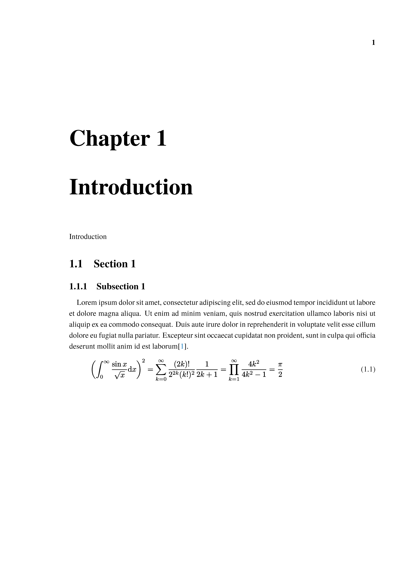
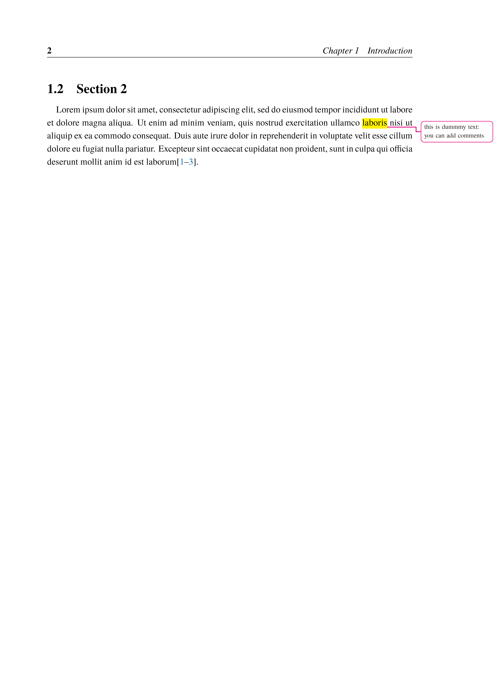

# ckthesis.cls

- $\mathrm{Lua\LaTeX}$ class for writing a thesis in Japanese or English.
- This class was created by using `ltjsbook` class.
  

## Prerequisites

- typeset by $\mathrm{Lua\LaTeX}$
- Language: English or Japanese

> [!NOTE]
>
> Operation check: $\mathrm{\TeX\ Live\ 2024}$


## Installation

There are two ways to use `ckthesis.cls`.

### Method 1

Place `ckthesis.cls` in the same directory as the $\mathrm{\TeX}$ file.


### Method2

Place `ckthesis.cls` in the `texmf-local/tex/latex` directory of $\mathrm{\TeX\ Live}$.

Linux system: if $\mathrm{\TeX\ Live}$ is installed in `/usr/local/texlive`, place `ckthesis.cls` and run `mktexlsr` as follows:

```
$ ls ckthesis.cls
ckthesis.cls
$ sudo mkdir /usr/local/texlive/texmf-local/tex/latex/ckthesis
$ sudo cp -f ckthesis.cls /usr/local/texlive/texmf-local/tex/latex/ckthesis
$ sudo mktexlsr
```


## Usage

### Class options

- `english` [boolean]: if true: the document language is English, otherwise Japanese
- `times` [boolean]:  if true: times font is used
- `draft` [boolean]: if true: all figures are converted to boxes and all hyperlinks are removed.
- `tombo` [boolean]: if true: with trim mark
- `fontsize` (default: `11pt`): fontsize of ltjsbook class (`10pt`, `11pt`, `12pt`)
- `b5paper` [boolean]: if true: b5paper, else: a4paper
- `left`   (default: `35truemm`): left margin dimension at odd pages
- `right`  (default: `20truemm`): right margin dimension at odd pages
- `top`    (default: `15truemm`): top margin dimension
- `bottom` (default: `20truemm`): bottom margin dimension
- `headsep` (default: `10truemm`): vertical length between the header and the top of the text area
- `headrule` [boolean]: if true: header with rule line
- `headfontsc` [boolean]: if true: heading font is Pagella small caps
- `reversemarginpar` [boolean]: if true: use \reversemarginpar and adjust \marginparwidth

Other: same options in ltjsbook (e.g. `fleqn`)

e.g.

```latex
\documentclass[
    english,
    times,
    fontsize = 11pt,
    left     = 35truemm,
    right    = 20truemm,
    top      = 15truemm,
    bottom   = 20truemm,
    headrule,
    draft,
    tombo,
    headfontsc,
    headsep  = 10truemm,
    fleqn,
    reversemarginpar
]{ckthesis}
```


### Document information

Document information such as title must be written in preamble.

#### Required settings

- `\title`
- `\data`
- `\author`

#### Optional settings

`ckthesis` has the following optional settings.

- `\University`: university name
- `\Department`: department
- `\SideTextAboveTitle`: text displayed in the left above the title
- `\CenterTextAboveTitle`: text displayed in the center above the title

#### example

The settings of

```latex
\title{Thesis title}
\author{Author name}
\date{date}
\University{University}
\Department{Department}
\SideTextAboveTitle{SideTextAboveTitle}
\CenterTextAboveTitle{CenterTextAboveTitle}
```

make the following title page:


### latexmk

This is a sample file of `.latexmkrc` for `latexmk`.

```latex
$latex = 'lualatex';
$bibtex = 'pbibtex';
$biber = 'biber';
$pdf_mode = 4;
$out_dir = 'result';
```


### Reference

It is recommended that the citations are managed by `biblatex`. The preamble of the sample $\mathrm{\TeX}$ file `sample.tex` imports the `biblatex` package and reads the source file of `reference.bib` as follows:

```latex
\usepackage[
        style=phys,
        backend=biber,
        sorting=none
]{biblatex}
\addbibresource{reference.bib}
```

The `reference.bib` file can manage many papers in the following format:

```latex
@article{Chizaki:MSSP2022,
    title = {Origin of temperature dependence of exciton radiative lifetime of {GaN} studied by phononic-excitonic-radiative model},
    journal = {Materials Science in Semiconductor Processing},
    volume = {148},
    pages = {106794},
    year = {2022},
    issn = {1369-8001},
    doi = {https://doi.org/10.1016/j.mssp.2022.106794},
    url = {https://www.sciencedirect.com/science/article/pii/S136980012200333X},
    author = {Masaya Chizaki and Kensuke Oki and Yoshihiro Ishitani},
}
```

The file in this format can be easily obtained from the paper's website. For instance, on the ScienceDirect website, select "Cite" > "Export citation to BibTeX".


## Sample images











